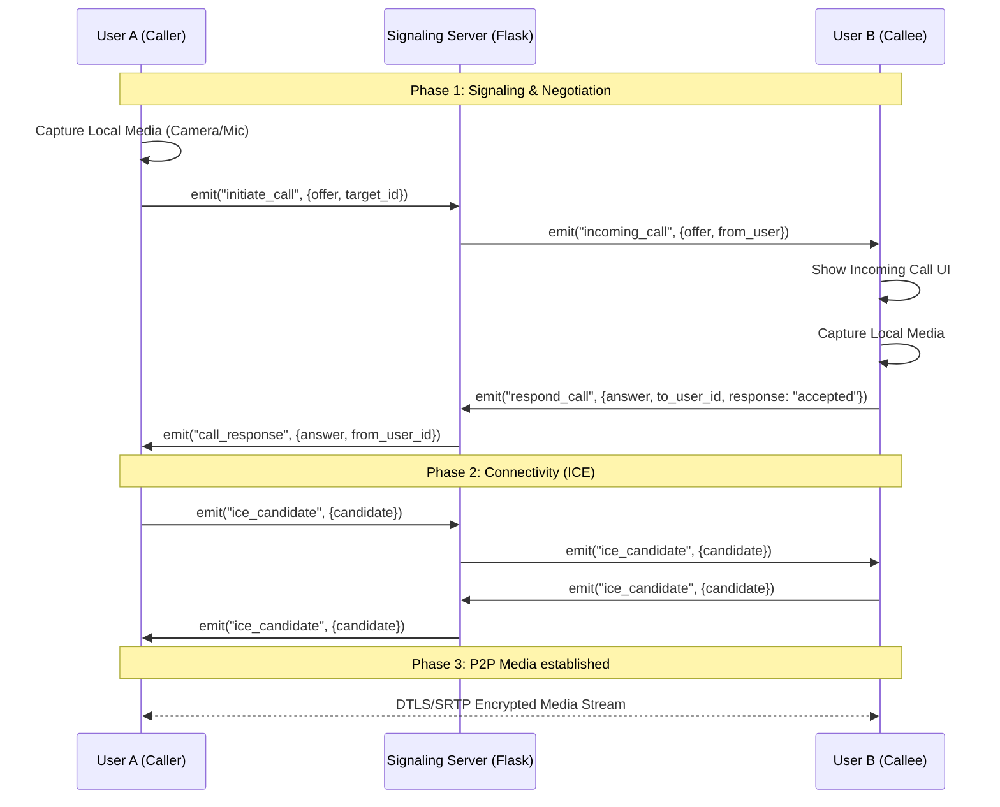

# Neurality Realtime Communication & Calling Architecture

This document provides a comprehensive technical overview of the calling and realtime messaging infrastructure within the Neurality social media platform. Designed for engineers and architects, it covers the protocols, signaling mechanisms, and security implementations used to achieve production-grade peer-to-peer (P2P) communication.

---

## 1. System Overview

Neurality utilizes a hybrid architecture for realtime communication:
- **Signaling Layer**: Powered by **Socket.IO** and **Flask-SocketIO**, providing a reliable bidirectional channel for connection orchestration.
- **Media Layer**: Powered by **WebRTC** (Web Real-Time Communication), facilitating direct encrypted audio/video streams between users.
- **Notification Layer**: Integrates with **Firebase Cloud Messaging (FCM)** for background alerts and incoming call wake-ups.

### Core Philosophy
The system follows a "Signaling-First, P2P-Second" approach. WebRTC handles the heavy lifting of media transfer, while Socket.IO ensures both peers know exactly when and how to connect, bypassing the need for expensive media servers (SFUs/MCUs) for 1-on-1 calls.

---

## 2. Technology Stack

| Technology | Role in Neurality |
|:---|:---|
| **WebRTC** | Core protocol for P2P media streaming and data channels. |
| **Socket.IO** | Realtime signaling, presence updates, and instant messaging. |
| **Flask-SocketIO** | Python-based backend implementation of the Socket.IO protocol. |
| **STUN (Google)** | Session Traversal Utilities for NAT; discovers public IP addresses. |
| **TURN (Future)** | Traversal Using Relays around NAT; relays traffic when P2P fails. |
| **JWT** | Secure authentication for socket connections. |
| **MediaDevices API** | Browser interface for camera and microphone access. |

---

## 3. Architecture & Flow

The following diagram illustrates the lifecycle of a call from initiation to established media stream.

---

## 4. Socket.IO Signaling Detail

Signaling is the "handshake" process. WebRTC cannot discover peers on its own; it requires a signaling server to exchange session descriptions (SDP) and network candidates (ICE).

### Primary Signaling Events

1.  **`initiate_call`**: Sent by the caller. Contains the `offer` (SDP) and metadata about the call type (voice/video).
2.  **`incoming_call`**: Broadcast by the server to the target user(s). Triggers the "Ringing" state on the callee's device.
3.  **`respond_call`**: Sent by the callee. Contains the `answer` (SDP) if accepted, or a "rejected/busy" status.
4.  **`call_response`**: Delivered to the caller. If "accepted", the caller sets the remote description to finalize the handshake.
5.  **`ice_candidate`**: A continuous stream of events as both browsers find the best network paths to each other.
6.  **`end_call`**: Explicit termination event that triggers cleanup on both ends.

---

## 5. WebRTC Implementation

Neurality's WebRTC logic is encapsulated in the `useWebRTC` hook, ensuring a clean separation from UI components.

### Connection Lifecycle
- **`RTCPeerConnection`**: The central object managing the connection. Initialized with Google's STUN servers.
- **Offer/Answer Model**:
    - **Offer**: Contains supported codecs, encryption keys, and media capabilities.
    - **Answer**: Confirms matching capabilities and provides the callee's keys.
- **ICE Candidate Management**: 
    - Candidates are queued until the `RemoteDescription` is set to prevent "race conditions" where a browser receives a network path before it knows who it's talking to.
- **Track Handling**: 
    - The `ontrack` event extracts the media stream from the peer and attaches it to the `remoteStream` state for rendering.

---

## 6. Security & Encryption

Neurality treats privacy as a first-class citizen.

- **DTLS (Datagram Transport Layer Security)**: All WebRTC signaling and data are protected by DTLS, preventing eavesdropping and tampering.
- **SRTP (Secure Real-time Transport Protocol)**: Audio and video tracks are encrypted using SRTP with keys exchanged during the DTLS handshake.
- **Authenticated Sockets**: Socket connections require a valid **JWT** in the `auth` header. If the token is invalid or expired, the connection is dropped immediately.
- **Browser Permissions**: Camera and microphone access are requested only when a call starts, following the principle of least privilege.
- **Secure Transport**: Both the API and Socket.IO operate over **HTTPS/WSS** to prevent Man-in-the-Middle (MITM) attacks.

---

## 7. Network Traversal (STUN/TURN)

Most users are behind NAT (Network Address Translation) or Firewalls.

- **STUN (Session Traversal Utilities for NAT)**: Used to discover the user's public IP address. Neurality currently uses Google's public STUN infrastructure (`stun.l.google.com:19302`).
- **NAT Traversal**: STUN works for ~80% of network configurations (Open, Moderate NAT).
- **TURN (Future Support)**: For Symmetric NATs (common in corporate environments), a TURN server acts as a relay. Future deployments will include a self-hosted **Coturn** instance to ensure 100% call connectivity.

---

## 8. Call State Machine

To ensure a predictable UI, the system transitions through a rigorous set of states:

- **`idle`**: No active call activity.
- **`connecting`**: User has clicked call; requesting media permissions and generating offer.
- **`ringing`**: Offer sent; waiting for callee to respond.
- **`active`**: Remote answer received; P2P stream established.
- **`ended`**: Call terminated by either party or connection lost.
- **`failed`**: Error in media capture or signaling.

---

## 9. Realtime Messaging System

While calling is high-bandwidth, messaging is high-frequency.

### Architecture
- **Persistent Socket**: A single socket connection is maintained for the duration of the session.
- **Room-Based Routing**: Users join private rooms (`user_{id}`) and group rooms (`group_{id}`).
- **Event Flow**:
    - `send_message` -> Backend persists to DB -> `receive_message` emitted to relevant rooms.
    - **Typing Indicators**: Lightweight events (`typing_indicator`) with a 3-second debounce.
    - **Read Receipts**: Triggered by `mark_messages_read`, updating the `is_read` status in the DB and syncing across all of the sender's sessions.

---

## 10. Notification System

Neurality ensures users never miss a call or message.

- **Socket-Based Alerts**: If the app is in the foreground, `incoming_call` and `receive_message` events trigger immediate UI updates and sounds.
- **FCM (Firebase Cloud Messaging)**: For background/killed states, the backend sends a high-priority push notification.
- **Incoming Call Notification**: On mobile/web, these are "Interaction" notifications that allow users to "Accept" or "Decline" directly from the notification tray.

---

## 11. Future Scalability

As Neurality grows, the following upgrades are planned:

- **SFU Integration (Selective Forwarding Unit)**: Transitioning from P2P to SFU (e.g., Mediasoup or LiveKit) for group calls. This reduces bandwidth requirements as users send one stream to the server instead of $N-1$ streams to other peers.
- **Coturn Infrastructure**: Geographically distributed TURN servers to reduce latency in relayed calls.
- **Media Optimization**: Dynamic bitrate adjustment based on network conditions (Adaptive Bitrate Streaming).

---

## 12. Comparison with Industry Leaders

| Feature | Neurality | WhatsApp / Discord |
|:---|:---|:---|
| **Signaling** | Socket.IO (Websockets) | Proprietary / XMPP / Websockets |
| **Media** | WebRTC (P2P) | WebRTC (SFU for Groups) |
| **Encryption** | DTLS/SRTP | End-to-End Encryption (Signal Protocol) |
| **Presence** | Realtime Socket States | Heartbeat Systems |

---

## 13. Code Structure

### Frontend (`frontend/src/hooks/useWebRTC.js`)
- **`startCall`**: Initializes local stream and emits `initiate_call`.
- **`acceptCall`**: Sets remote description, creates answer, and emits `respond_call`.
- **`cleanup`**: Closes peer connection and stops media tracks.

### Backend (`backend/sockets/chat_socket.py`)
- **`handle_initiate_call`**: Routes offer to target user or group.
- **`handle_respond_call`**: Routes answer back to caller.
- **`handle_ice_candidate`**: Forwards network candidates between peers.

---

## 14. Performance & Optimization

- **Socket Cleanup**: Automated removal of listeners in React `useEffect` to prevent memory leaks.
- **Peer Cleanup**: Explicit `pc.close()` and track stopping to release hardware (Camera/Mic) immediately after a call.
- **Optimistic Updates**: Messaging UI updates locally before the server acknowledges, providing a "Zero Latency" feel.
- **Lazy Rendering**: Call UI components are only mounted when `callStatus !== "idle"`.

---

*Document Version: 1.0.0*
*Last Updated: 2026-05-13*
*Author: Neurality Engineering Team*
